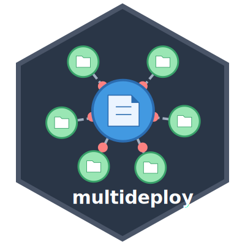

<!-- README.md is generated from README.Rmd. Please edit that file -->

```{r}
#| include: FALSE
knitr::opts_chunk$set(
  collapse = TRUE,
  comment = "#>",
  fig.path = "man/figures/README-",
  out.width = "100%"
)
```

# multideploy 

<!-- badges: start -->
[](https://github.com/coatless-rpkg/multideploy/actions/workflows/R-CMD-check.yaml)
[](https://lifecycle.r-lib.org/articles/stages.html#experimental)
<!-- badges: end -->

## Overview

The `multideploy` package provides tools for deploying file changes across multiple GitHub repositories. It's designed to help you manage standardized configurations, CI/CD workflows, and other common files that need to be synchronized across multiple repositories.

## Installation

You can install the development version of `multideploy` from [GitHub](https://github.comcoatless-rpkg/multideploy) with:

```r
# install.packages("remotes")
remotes::install_github("coatless-rpkg/multideploy")
```

## Authentication

`multideploy` uses the [`gh`](https://github.com/r-lib/gh) package for 
GitHub API authentication and querying. Before using `multideploy`, make sure
you have a GitHub Personal Access Token (PAT) set up:

```r
# Set GitHub PAT (or use .Renviron)
Sys.setenv(GITHUB_PAT = askpass::askpass("What is your GitHub Personal Access Token (PAT)?"))
```

It's recommended to store your PAT in your `.Renviron` file rather than in your code.

## Quick Start Example

Here's an example showing how to deploy a standardized CI workflow file to multiple repositories using `multideploy`:

```{r}
#| label: quick-example
#| eval: false
library(multideploy)

# List repositories in an organization matching a pattern
repos <- repos("my-organization", filter_regex = "^api-")

# Deploy a CI workflow file to the selected repositories
results <- file_deploy(
  source_file = "templates/check-standard.yml",
  target_path = ".github/workflows/R-CMD-check.yaml",
  repos = repos
)

# View results
print(results)
```

> [!IMPORTANT]
>
> The GitHub PAT used for authentication must have the necessary permissions to
> access and modify the repositories' workflows.

## Extended Overview

If you're looking for more detailed examples on how to use `multideploy`, we
step through the additional features of the package within this section.

### Repository Selection

List and filter repositories across users or organizations:

```{r}
#| label: repo-listing
#| eval: false
# Get all public repositories for a user
user_repos <- repos("username", type = "public")

# Get repositories for an organization matching a pattern
org_repos <- repos("orgname", filter_regex = "^data-")

# List organizations you have access to
my_orgs <- orgs()
```

### File Deployment

Deploy individual files or sets of files to multiple repositories:

```{r}
#| label: file-deploy
#| eval: false
# Deploy a single file
file_deploy("local/path/file.R", "remote/path/file.R", repos)

# Create a mapping of multiple files
mapping <- file_mapping(
  "local/lint.R" = ".lintr",
  "local/gitignore" = ".gitignore",
  dir = "templates/workflows",
  pattern = "\\.ya?ml$",
  target_prefix = ".github/workflows/"
)

# Create pull requests with multiple file changes
pr_create(
  repos = repos,
  branch_name = "feature/standardize-workflows",
  title = "Standardize CI workflows",
  body = "Implements organization-wide CI workflow standards",
  file_mapping = mapping
)
```

### Dry Run Mode

Preview changes before making them:

```{r}
#| label: dry-run
#| eval: false
# Preview changes without making them
file_deploy("local/file.R", "remote/file.R", repos, dry_run = TRUE)

# Preview PR creation
pr_create(repos, "branch-name", "PR Title", "PR Body", mapping, dry_run = TRUE)
```

## License

AGPL (>= 3)
